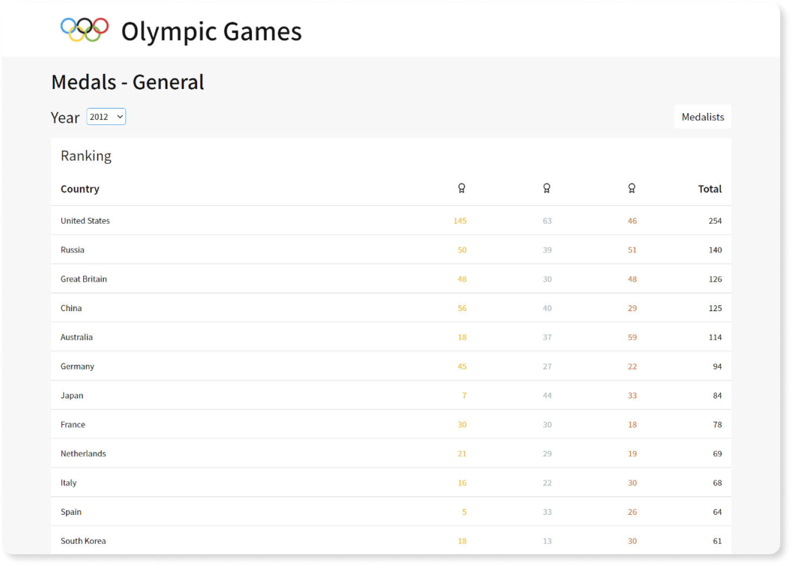

<h1 align="center">
  Olympic Games Data
</h1>

<p align="center">
  
</p>

<strong align="center">
  The goal was to develop web pages using ReactJS to view data regarding Olympic Games medalists and the data was consumed from a JSON file.
</strong>

<p align="center">
  

  

  
</p>

<p align="center">
  <a href="#features">Features</a>&nbsp;&nbsp;&nbsp;|&nbsp;&nbsp;&nbsp;
  <a href="#heavy_check_mark-settings">Settings</a>&nbsp;&nbsp;&nbsp;|&nbsp;&nbsp;&nbsp;
  <a href="#arrow_down_small-cloning-the-repository">Cloning the repository</a>&nbsp;&nbsp;&nbsp;|&nbsp;&nbsp;&nbsp;
  <a href="#beginner-starting-the-application">Starting the application</a>&nbsp;&nbsp;&nbsp;|&nbsp;&nbsp;&nbsp;
  <a href="#wrench-techs--tools--resources">Techs | Tools | Resources</a>&nbsp;&nbsp;&nbsp;|&nbsp;&nbsp;&nbsp;
  <a href="#memo-license">License</a>
</p>

### Features

- General page to view the gold, silver and bronze medals won by country according to the selected year;
- Medalists page to view the gold, silver and bronze medals won by athlete according to the selected year;
- Sports page to view the gold, silver and bronze medals by sports according to the selected year and country;
- Tables with pagination;
- Responsive pages.
### :heavy_check_mark: Settings

The settings to execute the application in your computer are listed below.

-  [Git](https://git-scm.com);
-  [Node](https://nodejs.org/);
-  [Yarn](https://yarnpkg.com/).

### :arrow_down_small: Cloning the repository
1. Through the terminal, go to the directory where you want to have the repository cloned and run the following command:
```bash
# cloning the repository
git clone https://github.com/belapferreira/olympics-data-view
```

### :beginner: Starting the application
1. Through the terminal, go to the directory where the repository was cloned and run the following command:
```bash
# installing dependencies
yarn install

# starting application
yarn start
```
### :wrench: Techs | Tools | Resources

This project was developed using the following resources:

-  [Editor Config](https://editorconfig.org/);
-  [Eslint](https://eslint.org/);
-  [Prettier](https://prettier.io/);
-  [React](https://pt-br.reactjs.org/);
-  [React Data Table Component](https://github.com/jbetancur/react-data-table-component);
-  [React DOM](https://pt-br.reactjs.org/docs/react-dom.html);
-  [React Icons](https://react-icons.github.io/react-icons/);
-  [React Router Dom](https://reactrouter.com/web/guides/quick-start);
-  [React Scripts](https://github.com/facebook/create-react-app/tree/master/packages/react-scripts);
-  [Styled Components](https://styled-components.com/).

### :memo: License
This project is under MIT license. See [LICENSE](https://github.com/belapferreira/olympics-data-view/blob/master/LICENSE) for more information.

---

Made by Bela Ferreira :blue_heart: Contact: https://www.linkedin.com/in/belapferreira :blush:
